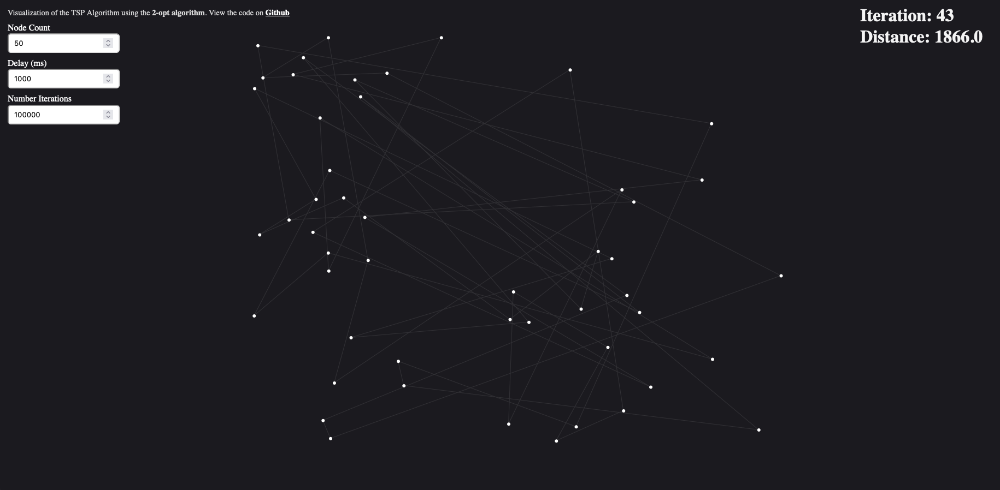
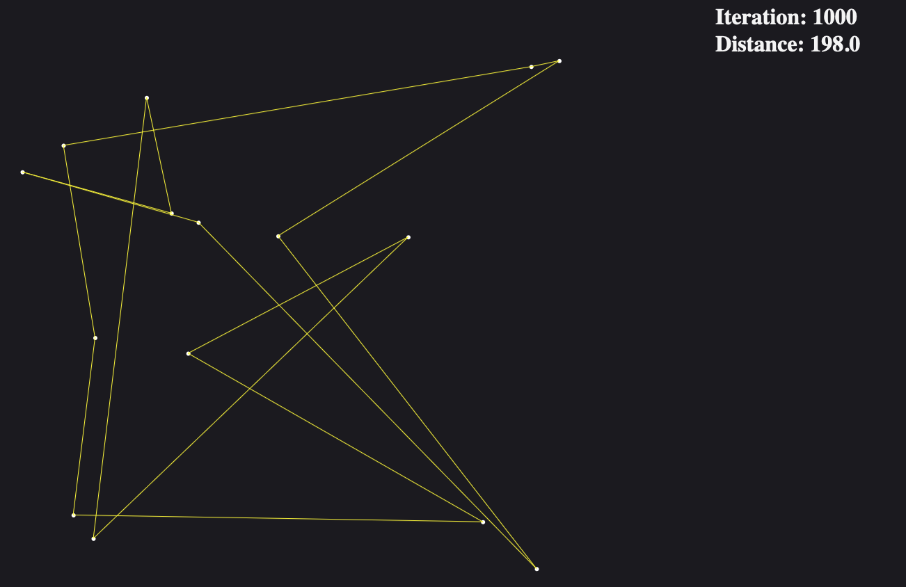

[](https://classroom.github.com/a/C_k9ew3E)

# Traveling Salesperson Problem -- Local Search

This exercise is about the Traveling Salesperson Problem I mentioned in the
lecture on NP-hard problems -- given a set of cities, determine the length of
the shortest tour that visits all of them. We can get from any city to any other
city, i.e. the graph of cities is completely connected. We consider the version
of the Traveling Salesperson Problem that finds the shortest tour to visit $n$
cities, starting at a city and ending at the $n$ th city; it _does not_ go
back to the start. The start city may be any of the cities. Remember that the
graph for a TSP is undirected, i.e. the cost is the same in either direction.

The 2-opt algorithm for solving the Traveling Salesperson Problem is a
randomized local search algorithm that, at each iteration, reverses part of the
route. It starts with a random route (this is the randomized part), and changes
part of the route in each step (this is the local search part, sprinkled with
more randomness). The pseudocode for one iteration is as follows:

```javascript
2optSwap(route, i, k)
  cities 1 to i-1 stay in the order they are
  cities i to k are reversed
  cities k + 1 to n stay in the order they are
```

For example, if I call the above function with route A--B--C--D--E--F, $i=2$,
$k=4$, the resulting route is A--B--E--D--C--F.

The algorithm starts with a random route; if the new route at the end of an
iteration decreases the total length, it is retained as the current incumbent.
The incumbent after the final iteration is returned as the solution.

Implement the 2-opt algorithm, which repeatedly runs the above steps. Your
implementation needs to fix two design parameters that I have left open. First,
you need to design a stopping criterion -- when would it make sense to stop and
return the shortest route found so far rather than trying another iteration?
Second, design a way to choose $i$ and $k$ -- note that they need to be
different in subsequent iterations, as one iteration would simply undo what
the previous one did otherwise. Start with the template I provided in `code.js`.
Describe in your code how you designed your stopping criterion and ways of
choosing $i$ and $k$ and why.

The function takes a distance matrix (the adjacency matrix for the graph where
the values in the cells are the distances between the corresponding cities) and
returns the length of the shortest tour (not the tour itself).

Test your new function; I've provided some basic testing code in `code.test.js`.

## Visualization

I created a visualization of this inside the `/visualization` folder. I know it was not required but I really wanted to see what it looked like when it ran. Plus the medium article I read had one and I wanted to be hip and create one too.

I hope you enjoy and let me know if it breaks. It is mostly stable but the input fields **_MUST_** be numbers xD. The larger your screen the better. I hard coded the width/height of the canvas and dont plan to make it responsive.

Here are some photos which demonstrate the visualization on diferent inputs.





## Runtime Analysis

**Overview**
My `tsp_ls()` function uses a local search heuristic to find a solution for the **Traveling Salesman Problem** (TSP). The function performs a set of iterations, each involving a swap of a part of the current route (`optSwap`) and checking the length of the new route (`calculateRouteLength`).

- `randomRoute(n)`: This function has a complexity of $O(n)$ as it creates a route array and shuffles it. Creating the array is linear and so is the shuffle so we get $O(2n) = $O(n)$.

- `calculateRouteLength(route, distances)`: This function calculates the total distance of the given route and also has a linear complexity. Since the function simply traverses the input and sums up the distances this provides a complexity of $O(n)$.

- `optSwap(route)`: This function modifies the route by performing a swap operation. This function has a wors-case complexity when the amount of shuffles is maximized. This means it will be $\Theta(n - 1)$ as we never shuffle the first element. This obviously simplifies to $\Theta(n)$.

The main loop in `tsp_ls()` iterates `maxIterations` times, executing the `optSwap()` and `calculateRouteLength()` functions in each iteration. The `maxIterations` is simply $n^2$ therefore, the worst-case asymptotic time complexity of the implementation is approximately $\Theta(maxIterations * n)$. This simplfiies to $\Theta(n^3)$.

## Resources

- https://slowandsteadybrain.medium.com/traveling-salesman-problem-ce78187cf1f3
- https://en.wikipedia.org/wiki/2-opt
